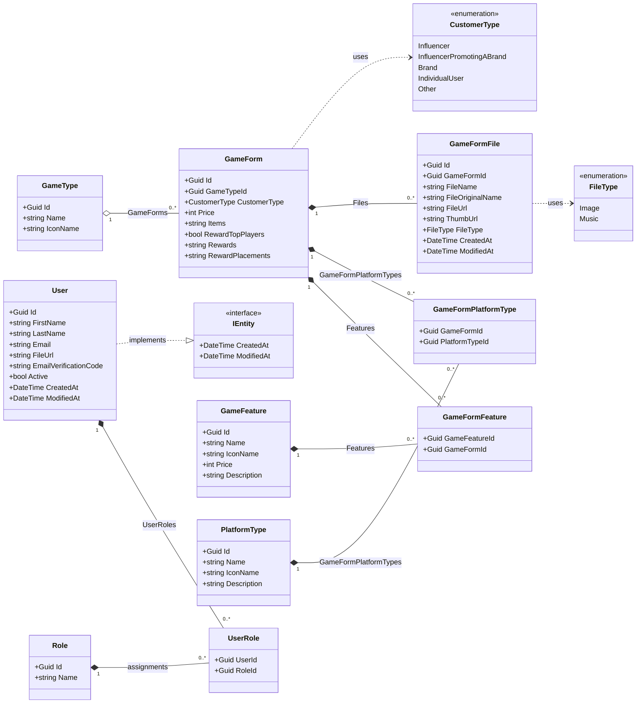

# Domain Class Diagram

> Course requirement #3 — domain model with **≥ 8 classes**. This repository has **8 game-domain
> classes** plus the ASP.NET Core Identity model (`User`, `Role`, `UserRole`, …).
>
> The diagram below is written in [Mermaid](https://mermaid.js.org/) and renders directly on GitHub
> and in most IDE markdown previews. To export an image/PDF for hand-in, open the rendered preview
> and use *Export*, or paste the fenced block into <https://mermaid.live>.

## Game-domain classes (8)

`GameForm`, `GameFeature`, `GameType`, `PlatformType`, `GameFormFeature`, `GameFormPlatformType`,
`GameFormFile`, `User`.

`GameFormFeature` and `GameFormPlatformType` are join entities that resolve the two many-to-many
relationships (a game form has many features and targets many platforms).

## Relationship summary

| From | To | Cardinality | Navigation |
|---|---|---|---|
| `GameType` | `GameForm` | 1 → many | `GameType.GameForms` / `GameForm.GameType` |
| `GameForm` ↔ `GameFeature` | via `GameFormFeature` | many ↔ many | `GameForm.Features` / `GameFeature.Features` |
| `GameForm` ↔ `PlatformType` | via `GameFormPlatformType` | many ↔ many | `GameForm.GameFormPlatformTypes` / `PlatformType.GameFormPlatformTypes` |
| `GameForm` | `GameFormFile` | 1 → many | `GameForm.Files` |
| `User` ↔ `Role` | via `UserRole` | many ↔ many | `User.UserRoles` |
| `User` | `IEntity` | implements | audit timestamps `CreatedAt` / `ModifiedAt` |

> Notes
> - `User` extends `IdentityUser<Guid>` and `Role` extends `IdentityRole<Guid>` from ASP.NET Core
>   Identity; only the project-specific members are shown above for clarity.
> - Nullable members (rendered without the `?` suffix so the Mermaid source parses cleanly on GitHub):
>   `GameForm.Price`, `GameFormFile.GameFormId`, and every `ModifiedAt` are nullable in code.
